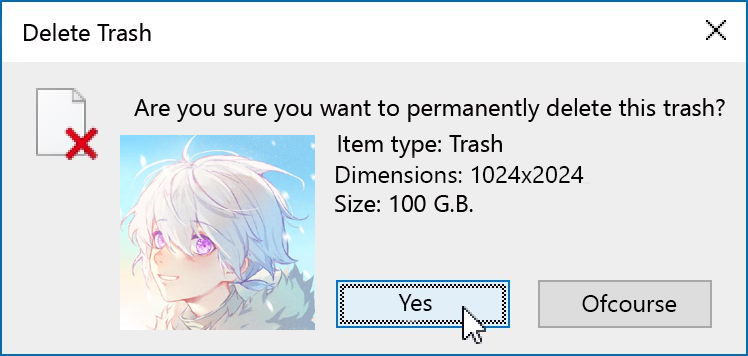
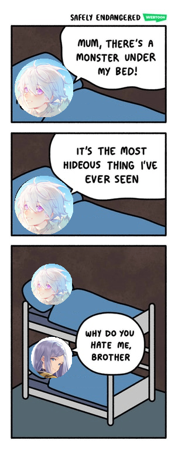

# PhotoMaker


**PhotoMaker** is a library to create funny pictures with your friends' photos.

## Installation 

```
pip install photomaker
```

## Examples


```python
from photomaker import *

MainKronos = None
someone = None

with open("documentation/input/me.jpeg", 'wb') as f:
	MainKronos = f.read()

with open("documentation/input/someone.jpeg", 'wb') as f:
	someone = f.read()
```


&nbsp;&nbsp;&nbsp;&nbsp;&nbsp;&nbsp;`MainKronos` &nbsp;&nbsp;&nbsp;&nbsp;&nbsp;&nbsp;&nbsp;&nbsp;&nbsp;&nbsp;&nbsp;&nbsp;&nbsp;&nbsp;&nbsp;&nbsp;&nbsp;&nbsp;&nbsp;&nbsp;&nbsp;`someone`

### Burn


> `MainKronos` is on fire.

```python
with open("output.gif", 'wb') as f:
	f.write(burn(MainKronos))
```

### Salt


> `MainKronos` needs to be salty.

```python
with open("output.gif", 'wb') as f:
	f.write(salt(MainKronos))
```

### Trash


> `MainKronos` is actually trash.

```python
with open("output.png", 'wb') as f:
	f.write(trash(MainKronos))
```

### Delete

> It is better to delete `MainKronos`.



```python
with open("output.png", 'wb') as f:
	f.write(delete(MainKronos))
```

### Hitler


> `MainKronos` is worst than Hitler.

```python
with open("output.png", 'wb') as f:
	f.write(hitler(MainKronos))
```

### RIP

> `MainKronos` is dead.


```python
with open("output.png", 'wb') as f:
	f.write(rip(MainKronos))
```

### Facepalm

> `MainKronos` is facepalming.


```python
with open("output.png", 'wb') as f:
	f.write(facepalm(MainKronos))
```

### Leader


> `MainKronos` is a good leader.

```python
with open("output.png", 'wb') as f:
	f.write(leader(MainKronos))
```

### Beautiful


> `MainKronos` is really beautiful.

```python
with open("output.png", 'wb') as f:
	f.write(beautiful(MainKronos))
```

### Affect


> `MainKronos` is the worst.

```python
with open("output.png", 'wb') as f:
	f.write(affect(MainKronos))
```

### Kiss

> `MainKronos` kisses `someone`.


```python
with open("output.png", 'wb') as f:
	f.write(kiss(MainKronos, someone))
```

### Spank


> `MainKronos` spanks `someone`.

```python
with open("output.png", 'wb') as f:
	f.write(spank(MainKronos, someone))
```

### Bed



> `MainKronos` says that `someone` is worse than a monster.

```python
with open("output.png", 'wb') as f:
	f.write(bed(MainKronos, someone))
```
